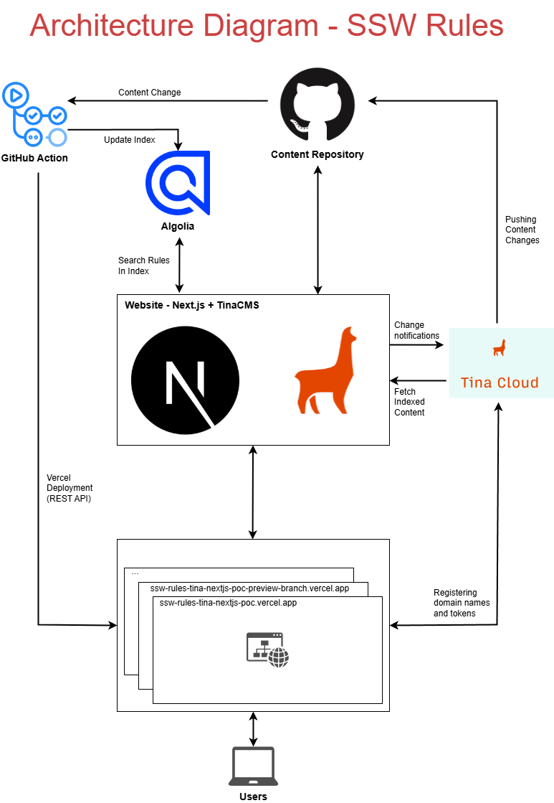

# SSW.Rules.Tina.Nextjs.POC
A POC that will validate the compatibility between Rules and Tina – using Next.js.  

The site pulls data from [SSW Rules Content Repo 📜](https://github.com/SSWConsulting/SSW.Rules.Content)
## Architecture Diagram

## Getting Started

### Required Tools
- Node.js (version defined in .nvmrc) – recommended to use nvm
- corepack (run corepack enable to manage correct pnpm version)
- pnpm package manager

### F5 experience

1. Clone [SSW.Rules.Content](https://github.com/SSWConsulting/SSW.Rules.content) and switch to the `tina/migration-dev-content` branch

2. Clone this repo

3. Place both repos in the same parent directory

4. Create a `.env` file based off `.env.example` in the root of this repo - get the values from Keeper (SSW.Rules.PoC Environment Variables)

5. Run `pnpm install` to install packages

6. Run `pnpm dev` to start the development server

### Syncing and Updating Content
To test changes to MDX rules:

1. Go to the `tina/migration-dev-content` branch of SSW.Rules.Content

2. Modify the rule MDX as needed

3. Run `pnpm dev` in this project to see the changes reflected locally

### Branches
- Always create a new branch for your PBIs 
- Always delete your branch once your PR has been merged
- To create a new **content branch** (in `SSW.Rules.Content`), follow the setup steps in the [Wiki](https://github.com/SSWConsulting/SSW.Rules.Content/wiki/How-to-Recreate-the-tina-main-Branch-(If-Deleted))
  

### Builds
- Changes made to http://github.com/SSWConsulting/SSW.Rules.Content (i.e. rule changes) trigger builds that deploy:
  - **main** to the **staging** site: https://salmon-tree-0bbb96a00.6.azurestaticapps.net/

### 📝 Adding Editorial Workflow
We've integrated TinaCMS with an editorial workflow to support content editing in a more structured way. If you're unfamiliar with how editorial workflows work in Tina, please refer to the official documentation:

👉 [TinaCMS Editorial Workflow Documentation](https://tina.io/docs/tina-cloud/editorial-workflow)

This workflow allows for content changes to be reviewed before being published, improving collaboration and content quality.
